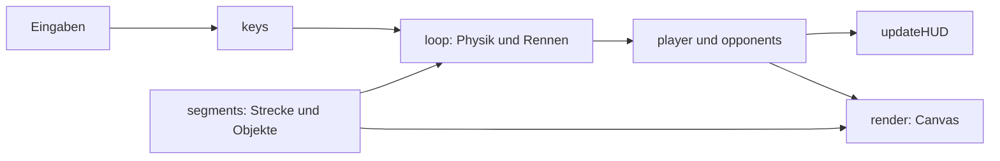
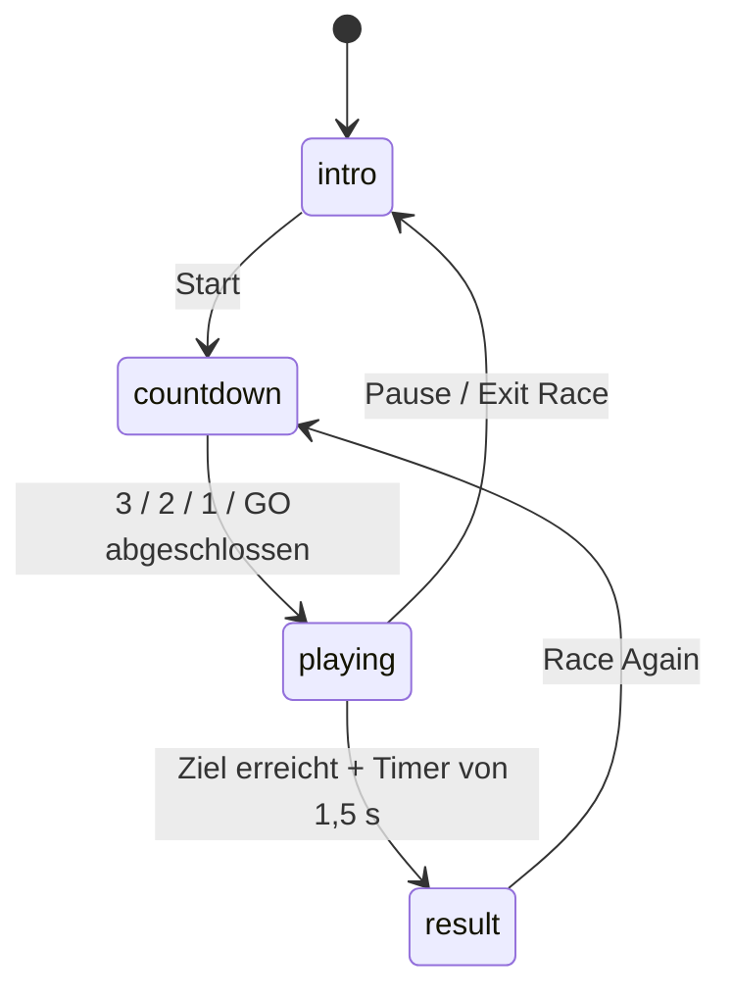

# Architektur und Spielregeln

Untersuchter Ausgangsstand: `af1c28b7951d1b6f9d46526a27ad40ce3147cc85`,
8. Oktober 2026. Beschrieben wird implementiertes Verhalten, keine neue
Produktvorgabe. Zeilennummern beziehen sich auf diesen Spielcode.

## Grundlage und Dateien

| Datei | Aufgabe |
| --- | --- |
| `index.html` | Oberfläche, CSS, gesamter Spielcode und Canvas-Darstellung; 8.396 Zeilen |
| `public/Welcome.png` | Einleitungsbild; wird ins Stammverzeichnis der Ausgabe kopiert |
| `package.json`, `package-lock.json` | Vite als einzige direkte Entwicklungsabhängigkeit; kein Framework |
| `vite.config.ts` | HMR und Dateibeobachtung abhängig von `DISABLE_HMR` |
| `metadata.json`, `.env.example` | AI-Studio-Metadaten und Vorlagen; keine aktive API-Nutzung |
| `.claude/launch.json` | Werkzeugkonfiguration für `npm run dev` auf Port 3000 |

Canvas 2D erzeugt eine perspektivische Straße aus Segmenten; keine 3D-Engine.
Fahrzeuge und fast alle Landschaftselemente entstehen in Zeichenfunktionen.
Maximale Breite: 480 Pixel, Höhe: `100dvh`. Der Canvas verwendet CSS-Pixel ohne
Skalierung nach `devicePixelRatio`.

Keine Netzwerk-API, Anmeldung, Audiofunktion oder Speicherung von Bestzeiten
und Spielständen im Spielcode. Google Fonts ist die einzige externe
Laufzeitressource. Vites Entwicklungsverbindung gehört zum Werkzeugbetrieb.

## Orientierung in `index.html`

| Zeilen | Inhalt / Einstiegspunkte |
| --- | --- |
| 1–139 | CSS, HUD, Steuerflächen und Overlays |
| 140–432 | Canvas-Größe, Hintergründe, Level-3-Zonen und Portale |
| 433–755 | `makeSection`, `buildSegments`, `getSeg`: Strecke und Objekte |
| 756–808 | Spieler, Gegner, Konstanten und Eingaben |
| 810–5650 | Projektion und Zeichenfunktionen |
| 5651–7416 | `render`: Szene, Sprite-Pool, Partikel und Effekte |
| 7418–7520 | `updateHUD`: Platzierung, Runden, Zeiten und Boost |
| 7522–7641 | `selectLevel`, Farbhilfsfunktionen |
| 7643–7882 | Zustände, Pause, Start, Ergebnis und Gegnerkollision |
| 7884–8356 | `loop`: Zeit, Fahrphysik, Items, Rundenwechsel und KI |
| 8358–8396 | Hauptmenü, Event-Zuordnung und Initialisierung |

## Daten und Ablauf

Gemeinsame globale Daten:

- `player`: seitliche Position `x`, Streckenposition `z`, Geschwindigkeit,
  Runde, Kollisionsschutz, Boost und Energie.
- `opponents`: fünf Fahrzeuge mit Position, Geschwindigkeit, Zielspur und
  einfachem Boost-/Ausweichverhalten.
- `segments`: Geometrie und veränderbare Objekte; Darstellung und Kollision
  teilen die gleichen Daten.
- `state`, `paused`, `keys`: Ablaufzustand, separates Pause-Flag und Eingaben.
- HUD-Cache und Partikelarrays: optimierte DOM-Aktualisierung und Effekte.

Beim Laden entstehen Hintergrund, Strecke und Gegner; danach läuft
`requestAnimationFrame(loop)`. `startRace` baut Strecke und Gegner neu auf und
setzt Spieler, Zeiten und viele Effekte zurück. `selectLevel` ändert vorher
Level und Parameter; der Neubau erfolgt erst beim Start.

`loop` glättet die vergangene Frame-Zeit und begrenzt den ungeglätteten Schritt
auf 50 ms. Physik und Rundenzeiten verwenden diese Simulationszeit. Intro,
Countdown-Animationen und Ergebnisverzögerung verwenden zusätzlich echte
Browser-Timer. Bei sehr niedriger Bildrate kann die Simulationszeit gegenüber
der realen Zeit zurückfallen.

`render` ist nicht rein darstellend: Es bewegt Wetterpartikel, erzeugt teilweise
Rauch und verwendet `Math.random`. Grafik, Streckenobjekte und KI teilen die
Zufallsquelle ohne festen Seed. Dies ist bei späterer Entkopplung relevant.

## Zustände

`intro` umfasst Einleitungsbild und Levelmenü. Pause ist `paused=true`, kein
eigener Zustand. Escape pausiert während `playing`; Physik und Rundenzeit
stehen dann, die Szene wird weiter gezeichnet. Nach dem Zieleinlauf ist
`finished=true`, aber `state` bleibt etwa 1,5 Sekunden lang noch `playing`.

`showResult` ersetzt das Menü-Overlay mit `innerHTML`. `showMainMenu` blendet
es wieder ein, rekonstruiert dessen Inhalt aber nicht. Der Ergebnis-Timer
wird beim Ausstieg nicht abgebrochen. Hier liegen die bestätigten Menüfehler.

## Strecken und Rennregeln

Ein Segment hat 150 interne Längeneinheiten; dies sind keine belegten Meter.

| Level | Segmente | Rennen | Charakter |
| --- | ---: | --- | --- |
| Neon City | 1.150 | 3 Runden | Stadt, Hügel, Brücke |
| Coastal Highway | 1.150 | 3 Runden | Küste, Felswand, Strand, wechselnder Himmel |
| Arctic Tunnel | 2.875 + 200 Auslauf | Eine durchgehende Strecke | Steppe → Tunnel → Arktis → Tunnel → Dalí → Tunnel → Unterwasser |
| Space Wave | 1.350 | 3 Runden | Sinus-Geometrie, Energiekugeln und Pfeilfelder |

Level 1–3 bestehen aus festen Abschnitten, Level 4 verwendet harmonische
Sinusfunktionen. Objektspuren und Landschaftsdetails werden neu zufällig gewählt.

Platzierung: zurückgelegte Distanz, bei Rundkursen
`(lap - 1) * TRACK_LENGTH + z`. Beim Spieler wird `z` am Rundenwechsel
zurückgesetzt. Gegner werden im normalen Fahrupdate nur nach Runde 1
zurückgesetzt; später kann `z` größer als die Streckenlänge sein. Kollisionen
haben eine weitere Normalisierung. Die Gesamtdistanz kann weiter stimmen,
aber die Darstellungen sind uneinheitlich: Umbau-Risiko, noch kein belegter
Platzierungsfehler.

Rundenzeiten entstehen beim Überqueren der Ziellinie. `BEST` ist die schnellste
Runde dieses Rennens. Endplatzierung wird beim Zieleinlauf ermittelt und
verzögert angezeigt. Gegner haben keine gespeicherten Zielzeiten oder einen
eigenen abgeschlossenen Rennzustand.

## Fahr- und Objektregeln

- Automatische Beschleunigung, kein Gas/Bremse. Normales Limit: 3.600 interne
  Einheiten pro Sekunde, angezeigt als 335 km/h. Lenkung wird mit Tempo stärker.
- Kurven ziehen seitlich; ab `abs(x) >= 0.94` bremsen Offroad-Regeln.
  Zusätzliche Begrenzungen hängen von Brücke, Tunnel, Küstenwand und Space ab.
- Blitz: eine Ladung, maximal drei. Manueller Boost verbraucht eine Ladung,
  dauert 1,2 Simulationssekunden und erhöht das Tempolimit auf Faktor 1,65.
- Pylonen bremsen leicht. Baustellen können kurz rückwärts stoßen und
  Kollisionsschutz auslösen. Neue Runden reaktivieren die Objekte.
- Space-Energiekugeln: fünf geben eine Ladung. Seitlich wechselnde Pfeilfelder
  erzeugen ohne Ladungsverbrauch Turbo mit Faktor 2,31 für zwei Sekunden;
  weitere Treffer verlängern ihn.
- Fünf Gegner wechseln Spuren, vermeiden Hindernisse und nutzen Boosts.
  Kleine Tempokorrekturen hängen vom Abstand ab. Die Wahrscheinlichkeit für
  Space-Pfeilfelder unterscheidet sich je Gegner. Gemeinsame Objekte können
  von Gegnern verbraucht werden.
- Gegnerkollisionen unterscheiden aktives Auffahren/Lenken des Spielers von
  einem von hinten auffahrenden Gegner. Der Kontaktabstand hängt von Kamera
  und Viewport ab; Grafik und Fahrphysik sind hier gekoppelt.

## Später sinnvoll aufteilen

Zuerst Menü und Zustandswechsel stabilisieren, danach Eingaben und Rennzustand
auslagern, anschließend Leveldaten und Simulation. Die großen Zeichenfunktionen
zunächst zusammenhalten. Nicht gleichzeitig Physik, Kamera und Kollisionsabstände
neu abstimmen. Partikel, Zufallsquellen und Zeitmodelle müssen bei einer Trennung
von Simulation und Darstellung bewusst zugeordnet werden. Eine neue Engine
oder ein UI-Framework ist für diese ersten Schritte nicht nötig.
